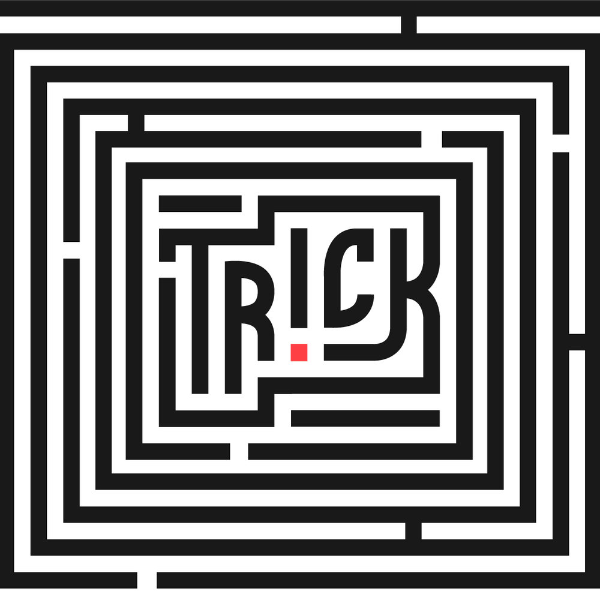

<a id="readme-top"></a>

<!-- PROJECT LOGO -->
<br />
<div align="center">
  <a href="https://github.com/dogethebeast/Trick/">
    
  </a>

  <h3 align="center">Trick</h3>

  <p align="center">
    A custom OOP language compiler written in Java
    <br />
    <br />
    <a href="https://dogethebeast.github.io/Trick/">View Demo</a>
    <!-- &middot; -->
    <!-- <a href="https://github.com/othneildrew/Best-README-Template/issues/new?labels=bug&template=bug-report---.md">Report Bug</a> -->
    <!-- &middot; -->
    <!-- <a href="https://github.com/othneildrew/Best-README-Template/issues/new?labels=enhancement&template=feature-request---.md">Request Feature</a> -->
  </p>
</div>


<!-- TABLE OF CONTENTS -->
<details>
  <summary>Table of Contents</summary>
  <ol>
    <li>
      <a href="#about-the-project">About The Project</a>
      <ul>
        <li><a href="#built-with">Built With</a></li>
      </ul>
    </li>
    <li>
      <a href="#getting-started">Getting Started</a>
      <ul>
        <li><a href="#prerequisites">Prerequisites</a></li>
        <li><a href="#installation">Installation</a></li>
      </ul>
    </li>
    <li><a href="#usage">Usage</a></li>
    <li><a href="#roadmap">Roadmap</a></li>
    <li><a href="#contributing">Contributing</a></li>
    <li><a href="#contact">Contact</a></li>
    <li><a href="#acknowledgments">Acknowledgments</a></li>
  </ol>
</details>


<!-- ABOUT THE PROJECT -->
## About The Project

As engineers, programming languages always seemed like a sort of black box to us. Therefore, we started this project because of our curiosity into compiler design and optimizations and to better understand how compilers work under the hood. 

### Built With

This project was built with the following frameworks:

* Java
* Gradle
* TeaVM

<!-- GETTING STARTED -->
## Getting Started

To run Trick locally, follow these steps (for UNIX based systems):

### Prerequisites

Make sure you have the following packages downloaded
*Java
*Gradle

### Installation

1. Clone the repo
   ```sh
   git clone https://github.com/dogethebeast/trick.git
   ```
2. Navigate into the cloned repository
   ```sh
   cd trick
   ```
3. Build the project
   ```sh
   ./gradlew build
   ```
4. Run the compiler either with a file for in REPL (Read Eval Print Loop) mode
   ```sh
   ./gradlew run #Figure out how to pass in file
   ./gradlew run #REPL
   ```

<!-- USAGE EXAMPLES -->
## Usage

Before cloning, you can check out the compiler on your browser by visiting this [webpage](https://dogethebeast.github.io/Trick/).

Use this space to show useful examples of how a project can be used. Additional screenshots, code examples and demos work well in this space. You may also link to more resources.


<!-- ROADMAP -->
## Roadmap

- [ ] Complete README.md
- [ ] Test error reporting
- [ ] Test blob reporting

<!-- CONTRIBUTING -->
## Contributing

Contributions are what make the open source community such an amazing place to learn, inspire, and create. Any contributions you make are **greatly appreciated**.

If you have a suggestion that would make this better, please fork the repo and create a pull request. You can also simply open an issue with the tag "enhancement".
Don't forget to give the project a star! Thanks again!

1. Fork the Project
2. Create your Feature Branch (`git checkout -b feature/AmazingFeature`)
3. Commit your Changes (`git commit -m 'Add some AmazingFeature'`)
4. Push to the Branch (`git push origin feature/AmazingFeature`)
5. Open a Pull Request

<!-- CONTACT -->
## Contact

Ratiq Narwal - [@ratiqnarwal](https://www.linkedin.com/in/ratiq-narwal/) - ratiqnarwal@gmail.com

Youssef Chaabani - [@youssefchaabani](https://www.linkedin.com/in/youssef-chaabani/) - ychaabani@gmail.com


<!-- ACKNOWLEDGMENTS -->
## Acknowledgments

Resources that were useful while building this project.

* [Crafting Interpreters] (https://craftinginterpreters.com)


<!-- MARKDOWN LINKS & IMAGES -->
<!-- https://www.markdownguide.org/basic-syntax/#reference-style-links -->
<!-- [contributors-shield]: https://img.shields.io/github/contributors/othneildrew/Best-README-Template.svg?style=for-the-badge -->
<!-- [contributors-url]: https://github.com/othneildrew/Best-README-Template/graphs/contributors -->
<!-- [forks-shield]: https://img.shields.io/github/forks/othneildrew/Best-README-Template.svg?style=for-the-badge -->
<!-- [forks-url]: https://github.com/othneildrew/Best-README-Template/network/members -->
<!-- [stars-shield]: https://img.shields.io/github/stars/othneildrew/Best-README-Template.svg?style=for-the-badge -->
<!-- [stars-url]: https://github.com/othneildrew/Best-README-Template/stargazers -->
<!-- [issues-shield]: https://img.shields.io/github/issues/othneildrew/Best-README-Template.svg?style=for-the-badge -->
<!-- [issues-url]: https://github.com/othneildrew/Best-README-Template/issues -->
<!-- [license-shield]: https://img.shields.io/github/license/othneildrew/Best-README-Template.svg?style=for-the-badge -->
<!-- [license-url]: https://github.com/othneildrew/Best-README-Template/blob/master/LICENSE.txt -->
[linkedin-shield]: https://img.shields.io/badge/-LinkedIn-black.svg?style=for-the-badge&logo=linkedin&colorB=555
[linkedin-url]: https://linkedin.com/in/ratiqnarwal
[product-screenshot]: webpage.logo.jpg
<!-- [Next.js]: https://img.shields.io/badge/next.js-000000?style=for-the-badge&logo=nextdotjs&logoColor=white -->
<!-- [Next-url]: https://nextjs.org/ -->
<!-- [React.js]: https://img.shields.io/badge/React-20232A?style=for-the-badge&logo=react&logoColor=61DAFB -->
<!-- [React-url]: https://reactjs.org/ -->
<!-- [Vue.js]: https://img.shields.io/badge/Vue.js-35495E?style=for-the-badge&logo=vuedotjs&logoColor=4FC08D -->
<!-- [Vue-url]: https://vuejs.org/ -->
<!-- [Angular.io]: https://img.shields.io/badge/Angular-DD0031?style=for-the-badge&logo=angular&logoColor=white -->
<!-- [Angular-url]: https://angular.io/ -->
<!-- [Svelte.dev]: https://img.shields.io/badge/Svelte-4A4A55?style=for-the-badge&logo=svelte&logoColor=FF3E00 -->
<!-- [Svelte-url]: https://svelte.dev/ -->
<!-- [Laravel.com]: https://img.shields.io/badge/Laravel-FF2D20?style=for-the-badge&logo=laravel&logoColor=white -->
<!-- [Laravel-url]: https://laravel.com -->
<!-- [Bootstrap.com]: https://img.shields.io/badge/Bootstrap-563D7C?style=for-the-badge&logo=bootstrap&logoColor=white -->
<!-- [Bootstrap-url]: https://getbootstrap.com -->
<!-- [JQuery.com]: https://img.shields.io/badge/jQuery-0769AD?style=for-the-badge&logo=jquery&logoColor=white -->
<!-- [JQuery-url]: https://jquery.com  -->
